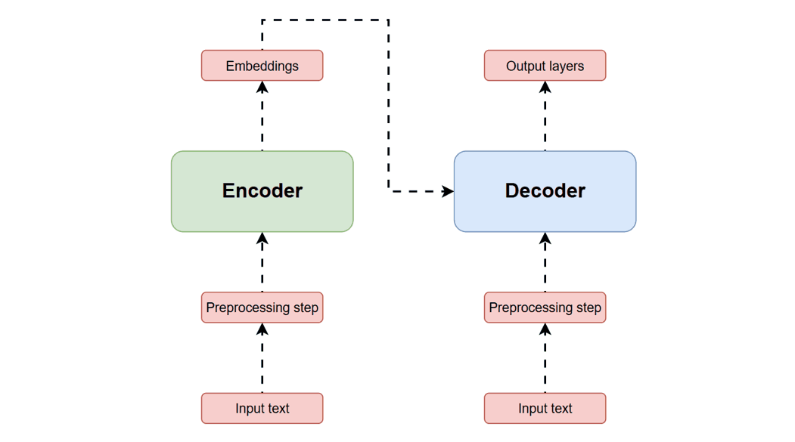
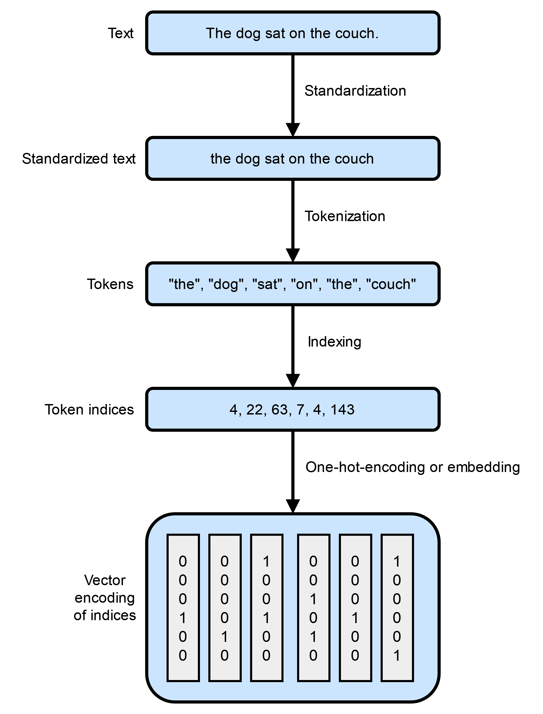

# Introduction

```{admonition} Learning Objectives
- Understand the basics of how an LLM works
- Learn the capabilities and limitations of LLMs
- Develop guidelines for the responsible usage of AI
```

Large Language Models (LLMs) are powerful AI tools that have the ability to
greatly enhance physics research. Built on deep neural networks, LLMs are
next-word prediction algorithms. Despite this rather limited design purpose,
LLMs have proven to be incredibly versitile in their application to other tasks.

In order to make effective use of these tools, we first need to understand how they work.

## How Does an LLM Work?

LLMs at their core are advanced deep neural network models. The main distinction that
leads to their powerful natural language processing (NLP) capabilities is the use of the
transformer architecture. A generic transformer consists of an encoder, which processes
input text into a series of vectors which embed the contextual information of the input, and
a decoder, which takes the embedding vecotrs and generates the output. Both the encoder and
decoder have a self-attention mechanism, which allow them to weigh the relationship between
different words in sequence. This is critical to a transformer's ability to generate
accurate and relevant text, as it allows it to capture contextual information about words
that are far from each other in the sequence. An example of a transformer being used in a translation task is shown here.



Building an LLM happens in stages. First, it is trained on a massive, unlabeled dataset of
text. This dataset must be diverse enought to allow the model to pick up things like syntax,
semantics, and other grammatical structures of the language. In order for the LLM to be able
to process the text, it must first be tokenized, or broken into individual chunks called
tokens and vectorized. There are many different methods of tokenization, but a common method
is to tokenize at the word or sub-word level.



The model extracts weights relating the tokens to each other from the dataset. At
this stage, the LLM has text completion capabilities, as well as the ability to perform new
tasks based on only a few examples. This pre-trained LLM is known as a foundation model.

Once you have a foundation model, it can be fine-tuned to perform more specific roles. This
is done with labeled data, and comes in many different forms, such as instruction
fine-tuning and classification fine-tuning.
